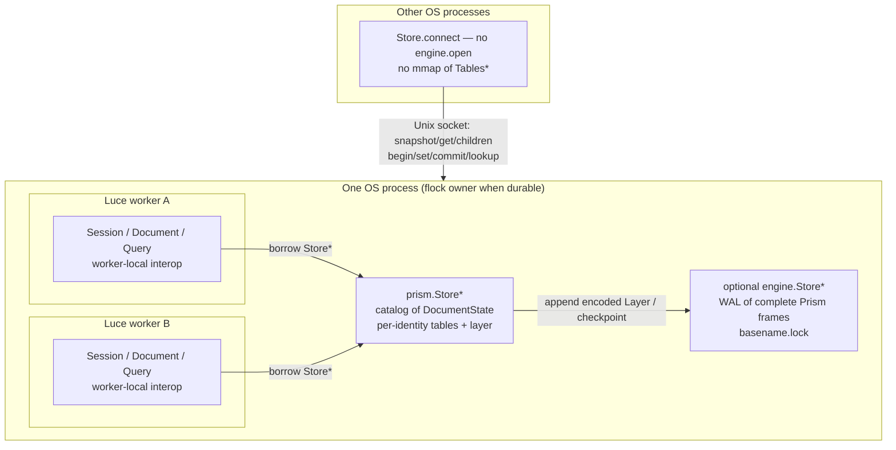

# Prism as LuciaOS In-Memory Data Plane

| Field | Value |
| --- | --- |
| Author | unassigned |
| Date | 2026-09-16 |
| Status | Draft |
| Packages | `luce-db` (`/Users/sedov/dev/luce-db`), `luce-prism` (`/Users/sedov/dev/luce-prism`) |
| OS context | LuciaOS (`/Users/sedov/dev/luciaos`); Prism is the filesystem/data plane |

---

## Overview

LuciaOS needs one in-memory data plane. That plane is Prism: a document is the database, its elements are the tables, and a **layer is a small pending-write map**, not a second copy of the document. Querying means probing that map for the keys the query actually touches, then the tables. Baking a layer is the write a database already does: mutate those entries in the tables, then drop the layer. A Store-wide **`memory_limit`** caps resident RAM; published payloads page under that ceiling instead of the OS swap file.

`luce-prism` is self-contained: in-memory tables plus its own WAL, flock, and save/load. `luce-db` is database *server* software that uses `prism.Store` as storage (networking, workers, authentication). It is not the typed data model and not the WAL owner.

`luce-prism` is the **main technology**: typed elements and properties, sparse layers, read-through queries, schema, persistent in-memory tables, `namei` across document identities, and the multi-user / multi-thread **service** (native `Store*`, worker-local handles, per-identity admission). Files-on-disk versus RAM is a storage backend. The composition model is not “a pile of `.prism` files that we flatten,” and live `get` is not `graft`.

The first mechanical fix is to stop treating `DocumentData` as both table storage and write buffer. Today overlay, event-log, field index, compose, and several mutators clone the whole document. That is a bug, not a model. Today’s `List[Element]` plus `Topology` also cannot snapshot the way `tree.hold` does; the published `Tables` type is a new persistent AVL, specified below — not a comment on `model.lucb`.

---

## Background & Motivation

### Current `luce-db` (verified)

Transactional **KV**, not SQL. Public facade: `src/luce_db/db.lucb` (`Database`, `Snapshot`, `Transaction`, `Migration`, `Value`). Native shared state: `src/luce_db/engine.lucb` (`Store`, `View`, `Transaction`) — `engine.Store` is already `pub`; `luce.toml` exports only `db`. Index: immutable structurally-shared AVL in `src/luce_db/tree.lucb`. Journal: `LUCE-DB-WAL-001` / checkpointed `LUCE-DB-WAL-002` in `src/luce_db/journal.lucb` and `src/luce_db/checkpoint.lucb`. Writers: bounded FIFO admission in `src/luce_db/writers.lucb` (32 waiters, 0–60s, fail-fast default). Process exclusivity: sidecar `{basename}.lock` next to the database file (`journal.lucb` formats `f"{file_name}.lock"`; README paraphrases this as `database-path.lock`). Luce/interop objects are thread-confined. `tests/registry_server.lucb` shares `var shared_database: db.Database*?` (the Luce façade) across HTTP workers; each handler calls `begin()` on its thread. Native sharing is the `engine.Store*` inside that façade (`db.lucb`), not a `Store*` passed in the fixture.

README omissions are explicit: no tables, no secondary indexes, no SQL parser, **no pager**, no replication. Schema in `src/luce_db/schema.lucb` is **application version metadata** (`LDSM`), not Prism types. `initialize_schema` writes only on a genuinely empty tree.

Current bounds (`README.md`, `src/luce_db/bytes.lucb`):

| Limit | Value |
| --- | ---: |
| Journal | 256 MiB |
| Transaction frame | 16 MiB |
| Ops / transaction | 65,536 |
| Key | 1–1,024 UTF-8 bytes |
| Value | 0–1 MiB |
| Index records | 1,000,000 |
| Active snapshots + transactions | 1,024 |
| Waiting commit attempts | 32 |

### Current `luce-prism` (verified)

Whole-document load/save (`src/luce_prism/document.lucb`, `src/luce_prism/io.lucb`). `DocumentData.elements` is an inline `List[Element]`, not `Element*` (`model.lucb`). `put_value` mutates `elements.items[index]` in place. `Topology` (`collections/topology.lucb`) is three mutable open-addressed hashes of **row numbers**. `Index` (`collections/index.lucb`) supports `prepare`/`commit`/`add`/`find`/`close` only — **no delete, no persistent node sharing**. `rename` and `remove` rebuild the entire `Topology` by scanning every element (`model.lucb`). There is no `hold` of a tables root.

Eager copies (see [Copy-site inventory](#copy-site-inventory)). `layers.overlay` starts with `base.copy()` then, if any reorder exists, `rebuild_order` copies again and re-emits every element (`composition/layers.lucb`). `emit_order` emits reorder-listed children **then remaining unemitted children**, not “the reorder list exclusively.” Overlay applies **deletions first**, then elements: `override` patches an existing path; `elif not element.override` inserts; override-only against a missing path is a no-op.

Bounds (`src/luce_prism/types.lucb`): `max_bytes = 256 MiB`, `max_items = 1,048,576`, `max_depth = 128`, path length ≤ 4,096 (`path.lucb`). `.` in a path starts a **slot**, not a filename extension; `notes.txt` is not a valid element path.

### Pain

1. **Write amplification.** Overlay/event-log/index/compose clone up to 1M elements. `set` of one property is cheap only on a unique in-place `DocumentData`.
2. **Layers are documents.** `mark_deleted` / `mark_unset` already describe a sparse delta, then `overlay` materializes a full clone.
3. **Head is a stored copy.** `EventLog.head` returns `current.copy()`. Head should be “tables + unpublished layer.”
4. **Grafting is the inner model for references.** Live `get` after `compose_file` sees a flattened tree; the OS cannot treat a reference as a link, and there is no `namei`.
5. **No snapshot-safe tables.** `List[Element]` + `Topology` cannot `hold` a root. In-place `put_value` is visible to every alias of that list.
6. **No shared native store.** Unlike `engine.Store`, Prism has no worker-safe native object (`luciaos/docs/THREADS.md`).

---

## Goals & Non-Goals

### Goals

- One Prism document **per identity** is the database. The **path index** (names, types, children, ids) stays resident. **Payloads** stay resident up to a configurable Store memory ceiling; beyond that they page to the durable backend instead of the OS swap file.
- A layer is a map of `(path, slot) → write|delete`, typically tiny. Stacking/collapsing layers is write-buffer / WAL-apply.
- Read-through query: probe the **View’s** frozen layer for touched keys, else the frozen tables root. No full-document overlay on `get` / `Query.rows` / `FieldIndex.equals`.
- Bake = apply those writes into the in-memory tables, then drop the layer. `DocumentState.bake` always `apply_cow` and publishes a new `Tables*` under `head_lock` (luce-db: build new root, short lock swap; no I/O under the lock). Unique-owner in-place apply is only `Document()` with no `Store`.
- Eliminate full-document copies on the live `set` / `query` / `compose` / `bake` paths.
- `luce-db` remains the durable/concurrent **KV interface** used by registry, packages, and Prism persistence. Prism does not query the WAL AVL for elements.
- `luce-prism` owns typed data, layers, queries, schema, persistent tables, `namei`, and the OS service.
- Filesystem semantics: `lookup` walks `/` components and **switches document identity** at a link, without copying the target’s elements. `children()` lists one identity. Dump/mount is a backend policy.
- Embeddable library and OS service share the same native `Store`.

### Non-Goals (this design)

- SQL parser, page cache, cost-based planner, replication.
- CRDT multi-master. Concurrent **sessions** exist; writers to one identity are FIFO-admitted and conflict only on overlapping `SlotKey`s.
- Network-share / shared-disk live WAL (already unsupported in `luce-db`).
- Grafting as the inner model of live `get` / `load`.
- Paging the **path index** (AVL nodes / `Element` headers) in v1. That is a real pager; if the index itself exceeds the Store limit, `add` fails.
- OS swap as the overflow strategy. The Store must refuse or evict **before** anonymous RAM grows into swap.
- Encryption, credentials, ACLs, multi-tenant isolation.
- Changing the Prism v4 on-disk crate format as the *live* database.
- Moving WAL/fsync/flock into `luce-prism`, or making `db.Database` speak Prism types.
- Importing `luce_db.writers` into RAM-only Prism.
- A luce-db pager, `put_chunked` API, or “drop AVL after replay” engine change in this work.

---

## Key Decisions

1. **Prism is the self-contained document engine; luce-db is the database server on top of it.** Prism owns RAM tables, layers, query, WAL (`luce_prism/wal`), flock, checkpoint, dump/load, and the Unix owner socket. It does **not** `import db`. Durable `Store.open` uses the in-tree WAL; RAM `Store.memory()` still does not open a journal. luce-db (`db.Database`) holds a `prism.Store` and adds process, listen/connect, and a required shared-secret token. After WAL replay, Prism **never** treats log keys as elements. The WAL AVL holds snapshot cookies/chunks plus the **unbaked tail**.

2. **`luce-prism` is the data plane and the multi-user service.** Typed elements, sparse layers, queries, schema, persistent `Tables`, per-identity admission, and worker-local `Session` handles live here. Copy `engine.Store`’s publication pattern (`head_lock` + FIFO + `hold` of a root). Do not reuse `luce_db.writers.Queue` — copy the 32-slot / 0–60s / fail-fast contract into `luce_prism/store.lucb` (or a tiny `luce_prism/admit.lucb`).

3. **A layer is a sparse write buffer, not a `DocumentData`.** Overlay is map-probe at read time; bake is apply-then-drop. `layers.overlay` copying `base` is the bug.

4. **Head is a read definition: published `Tables*` + unbaked commits `List[(generation, Layer*)]` + a session’s private `Layer*`.** There is **no** SlotKey-merged `published*` cache: later-wins per key is not sequential overlay (a delete of `/a` then an add of `/a/b` must not resurrect `/a/b`). Hot `get` probes private, then each unbaked layer oldest-first, then tables. Bake applies `unbaked` in order and **moves** those `(gen, Layer*)` to `retired`, still held until every View has `generation_base >= gen`. Bake does **not** bump the commit generation.

5. **Published `Tables` are a new persistent AVL of `Element*`, not `DocumentData` / `Topology` / `Index`.** Snapshots `hold` a tables root the way `tree.hold` retains an AVL root. `collections/index.lucb` stays the Layer / FieldIndex hash (no delete, no sharing) — it is **not** the published path index. `DocumentData.put_value` is **not** safe under snapshots. Unique-owner in-place is **`Document()` with no `Store` only**. `DocumentState` never mutates a root snapshots can `hold`; bake always COW-publishes.

6. **References stay as `reference` / `referencePath` metadata (links).** Live path lookup is `namei`: walk components, and at a link **switch identity** without copying elements. `compose` / `graft` become `materialize` for export/oracle only. `Session.get` / `children` / `Query` stay inside one identity unless they call `lookup`. **`std.files.kind` and FS helpers use `lookup(follow=true)`.** Intermediate links always follow; terminal follow defaults true. Do not export `kind_nofollow` until LuciaOS asks.

7. **Native `prism.Store*` is the only object that crosses workers; Luce `Session` / `Document` / `Query` / `Value` are worker-local.** Same contract as `engine.Store*` vs the `db.Database` façade. `registry_server.lucb` shows façade sharing + per-worker `begin()`, not passing `Store*` in Luce.

8. **Multi-process robustness is exclusive ownership plus a local IPC service, not a shared WAL.** One process holds `{basename}.lock` and the in-memory tables. Other OS processes are **clients** of that owner (`Store.connect`); they do not `engine.open` the journal and do not mmap live `Tables*`. v1 specifies the socket protocol (snapshot / get / children / begin / set / commit / lookup). No network filesystem, no forked open engine.

9. **Disk is a backend: optional complete-commit log + explicit dump.** A document may never hit disk. Not a directory of `.prism` files that the query engine flattens.

10. **WAL records are opaque encoded layers keyed by `(identity, commit generation)`, chunked so the sum of `journal.operation` encodings fits in `max_frame - 32`, in one `engine.Transaction`.** Element ids are assigned **at commit** under the identity’s writer lock and stored on the `Op` before encode. Layer lookup in RAM stays by path. After bake, one transaction writes a current snapshot and deletes baked log keys; open = snapshot + unbaked tail. Do not put Prism paths in luce-db keys. Do not journal interned `n/<id>` / `p/<id>/…` as a live KV image of the tables. The 256 MiB journal is a **working-set** ceiling (snapshot + unbaked tail), not a lifetime write budget.

11. **Name `Store.bake` / unique-owner `bake` for write-buffer apply; leave `evaluation.BakeContext` for graph eval.** (`prism.lucb` already exports `BakeContext`.)

12. **The Store has a configurable resident ceiling (`memory_limit`). Default 256 MiB, same number as `types.max_bytes`.** It is a **Store-wide** budget (all identities + layers + resident payloads), not a silent per-identity clone of `max_bytes`. `max_items` (1M elements / identity) stays a namespace cap. Format `max_bytes` stays a single-value cap. Refuse a private layer whose **journal encodings** would exceed `max_frame - 32` or 65,536 ops.

13. **After writer admission, conflict only on overlapping `SlotKey`s in `unbaked ∪ retired` with `generation > session.generation_base`.** If `generation_base == state.generation`, skip the set check. `retired` keeps baked `(gen, Layer*)` until every live View on that identity has `generation_base >= gen`, so Alice-commit / bake / Bob-same-key still `conflict`. FIFO serializes apply. Disjoint paths merge. Bake does not bump `state.generation`. Writer granularity is **per identity**.

14. **Virtual memory is a payload buffer pool under `memory_limit`, owned by Prism, not by the kernel.** Index + pinned layers never page. Cold **Value payloads** on published tables evict to the durable snapshot/extent store (PR 14). `get` of an evicted payload faults it back in, evicting something else if needed. If eviction cannot free enough, operations return `limit_exceeded` — they do not malloc into swap. `children` / `lookup` / `type_at` / `kind` do not fault (index only). Unbaked / private / retired layers are pinned until bake or the View dies. Optional `View.pin()` holds a compositor working set. Extents are this spill format, not a separate “large file” type only.

---

## Proposed Design

### Package split

```text
luce-db                              luce-prism
────────                             ──────────
Interface (used everywhere)          Data plane + service (main tech)
  Database / Snapshot /                Persistent Tables (path AVL → Element*)
  Transaction / Migration / Value      Sparse Layer (write buffer)
Durability engine (not a live          Read-through View / Query / Schema
twin of Prism tables)                  namei across identities
  engine.Store (pub, shared)           Native prism.Store (shared)
  AVL of log keys after replay         Worker-local Session; Document façade
  WAL 001/002, fsync, {basename}.lock  Per-identity FIFO (copied contract)
  writer FIFO, poison/reopen           Optional: persist via db.Database
  backup / checkpoint
```

`luce-prism` depends on `luce-db` **only** in the durable `Store.open` path (`persist.lucb`). `Store.memory()` must not import `luce-db`. `luce-db` does not depend on `luce-prism`.

### Type diagram

```text
prism.Store*                         native, refcounted, crosses workers
  catalog: identity → DocumentState*
  root: "root"
  persist: engine.Store*?            none for Store.memory()
  memory_limit: usize                default 256 MiB; Store-wide
  resident: usize                    index + layers + resident payloads
  pool: LRU of unpinned payloads     PR 14; until then refuse at limit

DocumentState                        one Prism document identity
  tables: Tables*                    published persistent root
  unbaked: List[(u64, Layer*)]       not yet applied to tables; oldest first
  retired: List[(u64, Layer*)]       baked, kept for overlap until min View base ≥ gen
  generation: u64                    last **commit** generation (bake does not bump)
  last_id: usize                     id allocator; writer-owned; not on Tables
  head_lock, writer: AdmitQueue      32-slot copy, not luce_db.writers
  views: bag[u64]                    live generation_base values; duplicates allowed
                                     # register/unregister/sweep_retired under head_lock
                                     # cap 1024 live Views per identity (engine.lucb:91)

Tables*                              hold/drop like tree.Node
  by_path, by_parent, by_id, …
  bytes: usize                       resident payloads only
  # no last_id — do not mutate Tables when references > 1

Layer                                unpublished or frozen published map
  items + Index (collections/index)  NOT shared across snapshots except
                                     via Layer* refcount of a frozen map

View                                 frozen; this is what Query sees
  identity, generation_base          # state.generation at snapshot/begin
  tables: Tables*                    held
  unbaked: List[(u64, Layer*)]       held prefix at snapshot (not retired)
  private: Layer*?                   Session writes only; snapshot = none

Session                              worker-local interop
  view: View
  write: bool                        begin() true; snapshot() false

Document                             façade over Session for codecs /
                                     Query(document) / existing tests
```

`Store.snapshot()` always returns a read `Session`. `Session.document()` returns a `Document` façade over the same `View` (adapter, not a second snapshot). `Store.begin()` returns a write `Session` with an empty private `Layer`.

**Authoring fast path:** `Document()` with no `Store` owns a unique `Tables` and empty `unbaked`. Mutations may call in-place apply (the old `put_value` shape) until a snapshot is taken. The moment the document is on a `Store` (or anyone can `snapshot_identity`), in-place apply is forbidden. Do not read `Tables.references` without `head_lock`.

### Native ownership (OS service and embed)



Join workers before `Store.close`. Never move a Luce/interop reference across `spawn` (`luciaos/docs/THREADS.md`).

Admission is **per `DocumentState`**: two identities do not share a FIFO. Readers take `head_lock` only to copy `(tables*, unbaked Layer*s, generation)`, `hold` those pointers, register `generation_base` on the `views` **bag**, then drop the lock — identical to `engine.snapshot`. `lookup` / `view_of` / `Store.snapshot` / `Store.begin` all go through `snapshot_identity`. They must not walk live pointers. `View.close`, `snapshot_identity`, and `sweep_retired` (including from `bake`) all take `head_lock`. Unregister removes **one** matching `generation_base` (two snapshots at gen 5 are two bag entries). Cap: 1,024 live Views per identity (`engine.lucb:91`).

### In-memory tables (actual representation)

`DocumentData.elements: List[Element]` and `Topology` **cannot** implement Decision 5. This section is the replacement. New module: `src/luce_prism/tables.lucb`. Algorithms for AVL `hold`/`drop`/`put`/`remove`/`find`/`at` are those in `luce_db/tree.lucb` (copy the code; do not import `luce_db.tree` into RAM Prism — that would pull `max_records` / `bytes` from db into the RAM path). Use Prism `max_items` (1,048,576) as the node-count cap.

```text
# Refcounted row. Same fields as model.Element minus override/removed_*,
# which belong on Layer.
pub struct Element:
    var references: @u64
    pub var identifier: usize
    pub var path: Buffer
    pub var kind: Buffer
    pub var properties: List[Property]    # sorted by name
    pub var metadata: List[Pair]

pub func hold_element(e: Element*)
pub func drop_element(e: Element*)        # frees at 0

# Ordered siblings of one parent. COW the whole list when that parent changes
# (O(siblings), not O(document)).
pub struct ChildList:
    var references: @u64
    var paths: List[Buffer]

# AVL node, tree.lucb shape. Path/parent/connection/asset keys are UTF-8.
# by_id keys are 8 raw big-endian bytes (not UTF-8). Byte compare only;
# do not str() or valid_key() them (today's Topology uses ASCII decimal
# in Index; this AVL is byte keys like tree.lucb).
pub struct Node:
    var references: @u64
    pub var key: Buffer
    pub var element: Element*?            # by_path
    pub var children: ChildList*?         # by_parent
    pub var path: Buffer                  # by_id value
    pub var conn_src: Buffer              # connections: key=target
    pub var asset: Asset*?                # assets
    pub var left: Node*?
    pub var right: Node*?
    pub var height: i32
    pub var count: usize

pub func hold(node: Node*?) -> Node*?
pub func drop(node: Node*?)

pub struct Tables:
    var references: @u64
    var by_path: Node*?                   # element path → Element*
    var by_parent: Node*?                 # parent path → ChildList*
    var by_id: Node*?                     # 8 raw BE bytes → path; not UTF-8
    var connections: Node*?               # target slot path → source slot path
    var assets: Node*?                    # asset path → Asset*
    var globs: List[Pair]                 # tiny; COW the list on change
    var bytes: usize                      # resident payload bytes (not evicted)
    # last_id lives on DocumentState only
```

**Snapshot:** `hold(tables)` increments `Tables.references` and the AVL roots’ node refs (same as `tree.hold` on each root pointer). Dropping a `View` drops the tables. Old `Element*` stay alive until no root points at them.

**Unique-owner `Document()` (no `Store`, no `snapshot_identity`):** `put_value` mutates `Element` in place; `ChildList` mutates in place. PR 4 bake. It is the only path allowed to resemble `DocumentData.put_value`.

**`DocumentState` (any Store bake/commit):** always **publish a new `Tables*`**. Never `apply_in_place` on the live root. Do not sample `Tables.references` without `head_lock` — it races with `snapshot_identity`. For a property set:

1. `find` the `Element*` (O(log n)).
2. If `Element.references > 1`, allocate a new `Element`, copy path/kind/properties/metadata, mutate the copy, `hold_element` the new one. If `references == 1` but the AVL spine is shared, still put a new node pointing at the (possibly same) element.
3. `put` on `by_path` allocates new `Node`s on the search path and `hold`s untouched siblings — **O(log n) new nodes**, not O(n) elements. Identical to `tree.put`.

Subtree `remove(path)`: walk `by_parent` from that path (O(subtree)), `remove` each descendant from `by_path` / `by_id` / `connections` / `assets`. Do **not** scan the whole document (today’s `model.lucb` `remove` does). Each `remove` COWs its AVL spine.

`rename`: same, O(subtree + log n per index), rewriting paths on copied `Element*` records. Also rewrite **layer keys** for descendant paths (today `DocumentData.rename` rewrites layer path records — keep that invariant on `Layer`).

**What is not this index**

| Existing type | Role after this design |
| --- | --- |
| `collections/index.lucb` `Index` | Layer map and FieldIndex buckets only. No `delete`, no `hold`. |
| `collections/topology.lucb` `Topology` | Retired from `Store`. May remain on unique-owner `DocumentData` until PR 7 replaces authoring. |
| `DocumentData` | Codec / compatibility / unique-owner authoring until tables land. Layer fields (`deletions`, `override`, `removed_*`) move to `Layer`. |
| `luce_db.tree` | Durability log AVL inside `engine.Store` only. |

### Virtual memory (resident ceiling)

OS swap of the Prism heap is the failure mode the limit exists to prevent: the kernel evicts at random, and the compositor stalls with the rest. Prism must not grow anonymous RAM until that happens. The Store owns a **buffer pool of Value payloads** under `memory_limit`.

```text
Store.memory(limit_bytes = 256 MiB)
Store.open(path, limit_bytes = 256 MiB)
store.set_limit(limit_bytes)    # fails if pinned + index already exceed
```

`memory_limit` is **one number for the whole Store** (every mounted identity). Default 256 MiB matches `types.max_bytes` so embed tests stay bounded. The OS owner process sets a larger value at open. Tests may set 32 MiB.

**Charged against the limit**

| Resident | Pageable? |
| --- | --- |
| Path / parent / id AVL nodes, `Element` headers (path, kind, property names, metadata) | **No.** If index growth would exceed the limit, `add` returns `limit_exceeded`. |
| Unbaked, private, and retired layer maps **including their payloads** | **No.** Write buffer. Bake to make those payloads evictable. |
| `View.pin()` / in-flight `get` payload | **No** until unpin / `Value` released. |
| Published table **Value payloads** | **Yes.** LRU among unpinned. |

IPC socket buffers and the luce-db journal are not in this counter (journal has its own 256 MiB working-set cap).

**Evict** (before `set`, bake apply, or a fault that would exceed the limit):

1. Walk LRU of unpinned resident payloads on published `Element*`s.
2. If the payload is already in the current durable snapshot / extent file, drop the RAM `Buffer` and leave a stub: `dtype`, `shape`, `size`, `locator` (identity + snapshot gen + extent id).
3. If it is not durable yet, it is in a layer — it is pinned; skip.
4. If nothing left to evict, return `limit_exceeded`. **Do not malloc.**

**Fault** (only when a caller needs the bytes):

1. `get` / `read` / query predicate that reads the value.
2. If stub: maybe evict LRU, load payload from locator into the pool, LRU-touch, return a `Value` (owned copy, then the pool entry may stay resident or not — pin during the copy).
3. `children`, `lookup`, `type_at`, `kind`, `exists`, `contains` **do not fault**. Listing a directory under memory pressure stays an index walk.

**Pin.** Compositor: `snap.pin("/world")` (subtree of that identity) so a frame’s working set is not evicted mid-draw. Pins count as resident. If `pin` would exceed the limit even after evicting everyone else, it fails — shrink the pin or raise `memory_limit`. Unpin on `View.close`.

**Bake vs VM.** Bake applies layer ops into tables (payloads become published, hence evictable). Under pressure, bake **then** evict. Do not page the layer itself.

**RAM-only `Store.memory()`.** There is no extent backend. Eviction cannot write. The limit is then a **hard cap with refuse**, same as today’s `max_bytes` but Store-wide and configurable. Paging requires `Store.open` (or an explicit spill directory). That is why PR 14 depends on persist/dump.

**Not this**

- `mmap` of a crate as the live table (COW AVL does not sit on file pages; IPC clients must not mmap `Tables*`).
- `madvise` / `setrlimit` as the policy (kills or still swaps).
- Paging AVL **nodes** in v1 (if the namespace itself exceeds the limit, the machine is mis-sized or the catalog should be another identity).

```text
fn charge(store, delta) -> !:
    while store.resident + delta > store.memory_limit:
        evicted = evict_one_unpinned(store) else error(limit_exceeded, "Prism memory_limit")
        store.resident -= evicted
    store.resident += delta
```

`tables.bytes` is **resident** payload only. `statistics.logical_bytes` is resident + evicted payload sizes (capacity accounting, not RSS).

### Sparse layer (first mechanical fix)

New module `src/luce_prism/composition/delta.lucb`. A layer is not a document.

Luce consumer sketch and native `Cell`/`Key`/`Op` are **1:1**:

| Luce `Write.slot` | Native `Key.cell` + `Key.name` |
| --- | --- |
| `"entry"` | `Cell.element`, name empty |
| `"prop:" + name` | `Cell.property`, name = property |
| `"meta:" + key` | `Cell.metadata`, name = key |
| `"conn"` | `Cell.connection`, path = target slot |
| `"disconn"` | `Cell.disconnect`, path = target slot |
| `"order"` | `Cell.reorder`, path = parent |
| `"asset"` | `Cell.asset` |

```luce
from prism import Store, Layer, Value, Query, Predicate, DType

pub enum WriteKind:
    set
    delete

pub struct Write:
    pub var kind: WriteKind
    pub var path: str
    pub var slot: str
    pub var value: Value?
    pub var type_name: str          # element add / set_type
    pub var override: bool          # element cell only; see visibility
    pub var identifier: i64         # 0 until commit assigns
    pub var children: list[str]     # reorder

pub class Layer:
    pub func count() -> i64
    pub func get(path: str, slot: str) -> Write?
    pub func put(write: Write) -> !
    pub func merge(later: Layer) -> Layer   # overlay-apply, same writer only
```

Native:

```text
pub enum Cell as u8:
    element = 0
    property = 1
    metadata = 2
    connection = 3
    disconnect = 4
    reorder = 5
    asset = 6

pub struct Key:                     # SlotKey
    var path: Buffer
    var cell: Cell
    var name: Buffer

pub struct Op:
    var deleted: bool
    var override: bool              # element cell; default true for property-only patches
    var identifier: usize           # 0 = unassigned; set at commit for new adds
    var type_name: Buffer
    var value: ValueData
    var text: Buffer                # metadata, connection source
    var children: List[Buffer]

pub struct Layer:
    var references: @u64            # frozen published layer is hold/drop
    var items: List[Pair[Key, Op]]  # sorted by (path, cell, name)
    var index: Index                # collections/index.lucb, encoded key → item row
    var generation_base: u64
```

**Collapse** of two layers from the **same** session (private onto unbaked this session already observed, or EventLog compact) is **overlay-apply**, not per-SlotKey union: apply the later layer’s ops in visibility order onto a copy of the earlier map (subtree delete drops descendant keys). Concurrent sessions do **not** later-wins on overlap — they `conflict` (Decision 13). Do not use `Layer.merge` as a `published*` cache.

`Layer.from_document` / `to_document` round-trip today’s layer `DocumentData` for compatibility tests. Preserve `override`. Do not keep a parallel full-document overlay on the hot path.

### Layer visibility (delete, override, reorder)

Match `layers.overlay` (`composition/layers.lucb:48-88`) and `emit_order` (`layers.lucb:9-27`).

**Apply order inside one layer** (read-through and bake, same order as overlay):

1. Element deletes (`cell=element`, `deleted=true`) — hide the path and its descendants for later steps in this layer.
2. Disconnects.
3. Element adds/patches: if the path is visible, patch type/properties/metadata. If the path is hidden/missing and `override=true`, **skip** (property-only overlay docs must not create elements). If missing and `override=false`, **insert** (re-add).
4. Property / metadata ops: if the path is still hidden after step 3, **ignore** (not an implicit re-add). Pick: ignored. Tests: delete then property-set in a later layer with `override=true` → still missing; later layer with `override=false` element add → re-created, then property ops apply.
5. Connections, assets.
6. Reorder: **priority list then residual children**, matching `emit_order`. The reorder list is not exclusive. Children named in the reorder that still exist and have this parent are emitted first (skipping duplicates); then any remaining children of that parent (including layer-adds not named in the reorder). A reorder that drops a sibling not listed still keeps that sibling, at the end — same as today.

**`visible` / `read_property`:** `DocumentData.remove` is a **subtree** delete (`model.lucb`; overlay `layers.lucb:52-54`). A child remaining in `by_path` after a parent tombstone is hidden. Re-adding the ancestor (`override=false` insert) does **not** resurrect descendants; only an explicit later element-add on that descendant path does (same as overlay: delete drops the subtree from the materialized document).

```text
fn layers_in_order(view) -> list[Layer*]:
    # unbaked oldest-first, then private (later wins)
    return view.unbaked.layers + [view.private]  # skip none

fn deletes_this_path(layer, path) -> bool:
    op = layer.get(path, element)
    return op != none and op.deleted

fn visible(view, path) -> bool:
    exists = (view.tables.by_path find path) != none
    for layer in layers_in_order(view):
        # subtree tombstone: delete of path or any ancestor hides, matching remove()
        a = path
        while true:
            if deletes_this_path(layer, a):
                exists = false
                break
            if a == "/": break
            a = parent_path(a)
        op = layer.get(path, element)
        if op != none:
            if op.deleted: exists = false
            elif not op.override or exists: exists = true
            # override && !exists: skip (property-only overlay against missing)
    return exists

fn read_property(view, path, name) -> Value?:
    if not visible(view, path): return none
    for layer in reversed(layers_in_order(view)):     # later first
        if op = layer.get(path, property:name):
            return none if op.deleted else op.value
        if op = layer.get(path, element) and op.deleted:
            return none
    return element_at(view.tables, path).property(name)
```

Hot path probes **private, then each unbaked layer oldest-first, then tables**. Do not collapse `unbaked` with per-SlotKey `Layer.merge`: that is not sequential overlay. Example that a merge cache gets wrong: commit delete `/a`, commit add `/a/b` — `get("/a/b")` must miss until a later layer explicitly adds `/a/b` (re-add of `/a` does not resurrect). Unbaked maps stay small because bake applies them (threshold 4096 ops). EventLog `at(offset)` may bake a prefix for history rather than looping N layers on every `get`.

**`children(parent)`:**

```text
fn emit_order_list(listed: list[str], acc: list[str]) -> list[str]:
    # Overlay emit_order: named children that are still in acc, then residual acc.
    out = []
    seen = {}
    for p in listed:
        if p in acc and p not in seen:
            out.append(p); seen.add(p)
    for p in acc:
        if p not in seen:
            out.append(p); seen.add(p)
    return out

fn children(view, parent) -> list[str]:
    if parent != "/" and not visible(view, parent):
        return []                                  # hidden/missing parent
    acc = copy ChildList at view.tables.by_parent[parent], or []
    for layer in layers_in_order(view):            # unbaked oldest-first, then private
        # (1) drop acc entries hidden by this layer's subtree deletes
        acc = [c for c in acc if not (
            deletes_this_path(layer, c) or deletes_this_path(layer, parent))]
        # (2) append visible element-adds whose parent_path is parent
        for (key, op) in layer where key.cell == element:
            if parent_path(key.path) != parent: continue
            exists = key.path in acc
            if op.deleted:
                continue                           # already dropped in (1)
            if not op.override or exists:
                if key.path not in acc:
                    acc.append(key.path)           # layer-add; needed before reorder
        # (3) reorder = listed-and-still-present, then residual (including layer-adds)
        if op = layer.get(parent, order):
            acc = emit_order_list(op.children, acc)
    return [c for c in acc if visible(view, c)]
```

`visible` cannot invent names that were never in `acc`. Without step (2), `tx.add("/users/alice"); commit(); snap.children("/users")` is empty, `Query.rows` misses unbaked rows, and `namei` cannot see a newly committed directory.

Required tests (PR 1/2): delete then property set on the **same** path; override-only layer against missing path; **add `/users/alice` in a layer, `children("/users")` contains it**; **reorder `/users` listing only `/users/bob` still yields `alice` in the residual tail**; **delete `/a` then `get("/a/b")` and `children("/a")` both miss**; **commit delete `/a` then commit add `/a/b` — `get("/a/b")` still misses**.

### Read-through and virtual rows

`Query` holds a `View` (today: a document reference, `query.lucb:16-28`). It must not see commits after `snapshot()`. It probes **that** View’s layers, never `store.published`.

`Query.rows` walks **document order**, not UTF-8 path inorder. Today it walks `doc.elements` (insertion / `rebuild_order` array order). After tables land, walk `by_parent` from `"/"` through `children()` (already `emit_order`):

```text
fn walk_document_order(view, parent="/"):
    for child in children(view, parent):       # visible, emit_order
        yield child
        walk_document_order(view, child)
```

Do **not** walk `tables.by_path` inorder. That would silently reorder unordered Query results and break overlay-array oracles.

**Virtual row — every visible path, not only layer-adds.** `accepts` reads `element.properties` (`query.lucb:81-97`). Unbaked `prop:` ops on an existing table row must be visible to `filter` the same way `FieldIndex.equals` patches from the layer.

```text
fn assemble_row(view, path) -> Element:        # stack, not stored
    if not visible(view, path): trap("row")
    if no_layer_ops(view, path):
        return copy_shape(element_at(view.tables, path))   # fallback
    row = Element(path = path)
    row.kind = read_type(view, path)           # layer element op or tables
    # every property name in tables ∪ layer prop ops for this path:
    for name in property_names(view, path):
        if let v = read_property(view, path, name):
            row.put_property(name, v)
    # metadata via the same later-wins read
    return row

fn Query.rows(view):
    for path in walk_document_order(view):
        stack = assemble_row(view, path)
        if accepts(&stack): yield path
```

`select()` copies assembled result rows into `Selection` (O(result), as today). Table `Element*` is a fallback **only** when both the unbaked list and private layer have no ops for that path.

`FieldIndex` is a function of a `View`, not of the live store:

- `init(view, field)` walks virtual rows of **that** View once, fills `Index` (scalar key → path or id).
- Holds `tables*` + `unbaked` Layer*s + `private*` + `generation_base` of the View.
- `equals` uses that index and, for keys present in **that View’s** unbaked/private layers, patches via `assemble_row` / `read_property`. It does not probe the live store. It does not rebuild from a baked-ops log (there is none).
- If someone mutates the View’s document (callback rule), the existing revision check fires (`query.lucb:87-99`).

`Schema.validate` and `ColumnTable` take a View. `ColumnTable` may copy **one** assembled row after layer probe. `TextIndex` / `SpatialIndex` / `VectorIndex`: build from View rows once (out of scope to make them incremental).

### Bake

```text
# state.views is a bag of generation_base. All three take head_lock.
fn min_view_base(state) -> u64:               # caller holds head_lock
    if state.views is empty: return state.generation
    return min(state.views)

fn sweep_retired(state):                      # caller holds head_lock
    while state.retired is not empty and state.retired[0].gen <= min_view_base(state):
        drop(state.retired[0].layer)
        state.retired.remove(0)

fn unregister_view(state, generation_base):   # caller holds head_lock
    # bag: remove one matching entry, not every 5 if two snapshots began at 5
    if let i = first index of generation_base in state.views:
        state.views.remove(i)
    sweep_retired(state)

fn bake(state: DocumentState*):
    admit writer
    # Do NOT bump state.generation. Overlap uses commit generation only.
    # Always COW — never apply_in_place on a Store root. Snapshots hold
    # tables under head_lock without the writer FIFO (engine.lucb commit).
    applied: List[(u64, Layer*)] = []
    tables = state.tables                     # borrow pointer; do not mutate
    for (gen, layer) in state.unbaked:        # oldest first
        tables = apply_cow(tables, layer)     # new spines; old root unchanged
        applied.append((gen, layer))          # KEEP hold — do not drop
    state.head_lock.lock()                    # short swap; no I/O under the lock
    state.tables = tables
    for item in applied: state.retired.append(item)
    state.unbaked.clear()
    sweep_retired(state)
    state.head_lock.unlock()
    opt durable: reclaim_log(state)           # snapshot + remove baked u/ keys
```

`apply_in_place` is **`Document()` with no `Store` only** (PR 4). `DocumentState.bake` always `apply_cow` and publishes the new `Tables*` under `head_lock`. Do not read `Tables.references` without that lock. Bake of `cell=element, deleted` is subtree remove via `apply_cow` (`by_parent` walk).

**Overlap after bake (required).** Clearing `unbaked` without `retired` lets Bob overwrite Alice:

1. Alice and Bob `begin` at generation 5.
2. Alice commits `/a` → generation 6, `unbaked` holds L6.
3. Bake applies L6. If `unbaked = []` and generation stays 6, Bob’s overlap set is empty and `/a` is published without `conflict`.

`retired` prevents that: L6 stays until every View has `generation_base >= 6`. `keys_committed_after` unions **unbaked and retired**. Store bake always publishes a **new** `Tables*`; pointer equality is not an overlap signal.

Threshold (sum of unbaked layer sizes, RAM): bake when total `layer.count() >= 4096` or estimated encode ≥ 1 MiB. This is not the private-layer journal cap. Not automatic on every `set`. Retired layers count toward `active_views` memory the same way luce-db old snapshots retain AVL nodes; `sweep_retired` on `View.close`.

### ID allocation at commit

`Element.identifier` is assigned by `topology.append` today only when a row hits `DocumentData`. Unbaked `add` lives in the layer keyed by **path**. Persistence and `by_id` need an id **before** encode.

```text
fn keys_committed_after(state, generation_base) -> set[SlotKey]:
    keys = {}
    for (gen, layer) in state.unbaked:
        if gen > generation_base: keys.add_all(layer.keys)
    for (gen, layer) in state.retired:
        if gen > generation_base: keys.add_all(layer.keys)
    return keys

fn commit(session):
    state = session.identity
    try state.writer.enter(wait_ms)
    defer leave

    # After FIFO: if nothing committed since begin, skip the set check.
    if session.view.generation_base != state.generation:
        if overlap(session.private.keys, keys_committed_after(state, session.view.generation_base)):
            error(conflict)    # restart; do not later-wins across sessions
    # Disjoint keys: proceed. FIFO means no concurrent apply.

    next_id = state.last_id                    # DocumentState only
    next_id = max(next_id, max_id_in_unbaked(state.unbaked))

    for op in session.private where cell == element and not op.deleted:
        if op.identifier != 0: continue
        if let existing = id_of(state.tables, state.unbaked, op.path):
            op.identifier = existing          # patch of a live/unbaked element
        else:
            next_id += 1
            op.identifier = next_id           # reserved, even if bake is later

    # Durable I/O outside head_lock (engine.lucb: admit → I/O → short publish).
    frozen = freeze(session.private)
    opt durable:
        engine.Transaction.commit of u/<identity>/<next_gen> chunks
        # next_gen = state.generation + 1; if I/O fails, do not publish
    state.last_id = next_id                   # writer-owned; not on Tables

    state.head_lock.lock()                    # short swap; no I/O
    state.generation += 1                     # commit generation only
    state.unbaked.append((state.generation, frozen))
    state.head_lock.unlock()
```

Snapshots copy `unbaked` + `generation` only under `head_lock`. FIFO serializes writers, not snapshots — publishing those two fields without the lock is a torn commit (generation 6 without L6, or iterate-while-append).

Replay of the **unbaked tail** (open after snapshot load): decode each complete `u/<identity>/<gen>` oldest-first into `unbaked`; do not bake until asked. `retired` starts empty after open (no concurrent Views). The layer blob is self-contained.

### Persistence via `luce-db` (durability log, not a live index)

Pure-RAM `Store.memory()`: `persist = none`. Crash loses state. `Store.dump(path)` writes a Prism crate (`Document.encode` / `io.write` atomic). Caller chooses.

`engine.Transaction.put` refuses when `operations >= 65536` or `payload.count + 9 + key.length + value.length > max_frame - 32` (`engine.lucb:117`). `journal.encode_frame` then wraps that payload in a 32-byte TXN1 header/trailer. Sixteen 1 MiB chunks plus a `#` header overflow that payload (`16 * (9 + ~30 + 1048576) > 16 MiB`). The cap is therefore on the **sum of `journal.operation` encodings**, not the raw layer byte length.

```text
PAYLOAD_BUDGET = max_frame - 32          # 16_777_184
fn encoded_put(key, value) = 9 + key.length + value.length   # journal.operation

fn journal_bytes_for_layer(identity, gen, layer_bytes) -> usize:
    gk = unbaked_key(identity, gen)      # "u/<identity>/<20-digit-gen>"
    if layer_bytes <= max_value:
        return encoded_put(gk, layer_bytes)
    n = ceil(layer_bytes / max_value)
    total = encoded_put(gk + "/#", ascii_decimal(n))
    remaining = layer_bytes
    i = 0
    while remaining > 0:
        chunk = min(max_value, remaining)
        total += encoded_put(gk + "/" + decimal(i), chunk)
        remaining -= chunk
        i += 1
    return total
```

`Layer.put` / `commit` refuse when `layer.count() > 65536` or `journal_bytes_for_layer(...) > PAYLOAD_BUDGET`. Persist test: a layer just under that cap commits in one `engine.Transaction`; one byte over fails before append.

**Identity cap.** Longest log key is `u/<identity>/<20-digit-gen>/#` (25 bytes of prefix/suffix). `valid_key` allows 1024 bytes, so a max-length identity overflows `engine.put`. Identities are:

- 1–200 UTF-8 bytes
- ASCII letters, digits, `.`, `_`, `-` only
- not `"."` or `".."`, no `/`, no NUL
- `reference` / `Store.mount` strings must match this cap (authored `"media.prism"` does)

Snap filenames use the identity as a path component under `{dbpath}.snap/`; rejecting `".."` is required.

**Log format (version 0).** Keys ASCII, ≤ 1024 bytes. Values ≤ 1 MiB.

```text
u/<identity>/<20-digit-gen>        unbaked layer if ≤ 1 MiB
u/<identity>/<20-digit-gen>/#      chunk count (ASCII decimal)
u/<identity>/<20-digit-gen>/<n>    chunk n
s/<identity>/through               ASCII commit generation baked into the snapshot
s/<identity>/kind                  "inline" | "file"
s/<identity>/file                  basename only, when kind=file
s/<identity>/#  and  s/<identity>/<n>    inline snapshot chunks (optional)
```

One Prism `Session.commit` = **one** `engine.Transaction` containing every `u/…` key for that `(identity, gen)`. No torn multi-transaction commit.

**Reclaim (required).** `Database.checkpoint` encodes **current AVL records**; it does not delete keys. Replaying `u/<gen>` from 1 forever would make 256 MiB a lifetime write budget. After RAM bake (or on `Store.checkpoint`):

```text
fn snap_basename(identity, through) -> str:
    # identity already validated (no "..", no "/")
    return identity + "." + decimal(through)

fn reclaim_log(store, identity):
    state = store.catalog[identity]
    # tables now equal baked head; unbaked is empty; retired may still be held
    crate = encode_identity_crate(state.tables)     # existing Document.encode
    through = state.generation                      # last commit applied
    old_file = get s/<identity>/file                # previous basename or none
    name: str? = none                               # set only on the file branch
    tx = engine.transaction(store.persist)
    if encoded_put_sum(inline snap keys) <= PAYLOAD_BUDGET:
        put s/<identity>/kind = "inline"
        put chunked crate as s/<identity>/# + s/<identity>/<n>
        remove s/<identity>/file if present
        # name stays none — inline-from-file still deletes old_file below
    else:
        # NEW file — do not overwrite the live snap before the cookie commits.
        make_directory("{dbpath}.snap")
        name = snap_basename(identity, through)     # e.g. media.prism.6
        write_atomic("{dbpath}.snap/" + name, crate)
        put s/<identity>/kind = "file"
        put s/<identity>/file = name                # basename only
        remove any previous s/<identity>/# and s/<identity>/<n>
    put s/<identity>/through = ascii(through)
    for each existing u/<identity>/<gen> with gen <= through:
        tx.remove(that key)                         # including /# and /n
    tx.commit()
    engine.checkpoint(store.persist)                # rewrite WAL to current keys
    # After commit: delete previous sidecar if we did not keep that basename.
    # Inline-from-file: old_file != none and name == none → delete.
    if old_file != none and old_file != name:
        delete("{dbpath}.snap/" + old_file) catch ignore
```

Crash after writing `{identity}.{through}` and before `tx.commit`: journal still names the **old** `s/file` (or none). Open loads exactly that cookie. The new file is an **orphan** and is ignored. Crash during `tx`: luce-db torn-tail rules. Never `write_atomic` onto the live snap name.

**Open:**

```text
fn catalog_identities(db) -> set[str]:
    ids = {}
    for i in 0 ..< snapshot.count():
        k = snapshot.key_at(i)
        # s/<id>/through  or  u/<id>/<gen>  or  u/<id>/<gen>/#
        if k starts with "s/" or k starts with "u/":
            ids.add(identity_from_key(k))
    return ids

fn open(path):
    db = engine.open(path)                    # flock {basename}.lock
    if tree.count(db.root) == 0:
        initialize_schema(db, "prism/encoding", "luce-prism")  # version 0
        empty catalog, empty root DocumentState
        return Store(persist=db)
    ver = schema.current(snapshot, "prism/encoding", "luce-prism")
    if ver == none: error(invalid, "unversioned journal is not a Prism store")
    if ver != 0: error(unsupported, "prism/encoding")
    for identity in catalog_identities(db):   # s/through OR u/ keys
        through = parse(get s/<identity>/through) else 0
        if get s/<identity>/kind == "file":
            name = get s/<identity>/file      # basename; reject "/" and ".."
            load crate "{dbpath}.snap/" + name into unique-owner tables
        elif kind == "inline":
            decode s/<identity> chunks into unique-owner tables
        else:
            empty unique-owner tables         # never-baked identity
            through = 0
        for gen in (through+1) ..= max complete u/<identity>/<gen>:
            layer = decode_layer(read_chunks(u/<identity>/<gen>))
            state.unbaked.append((gen, layer))
        state.generation = max complete u/ gen if any else through
        state.retired = []                    # no concurrent Views yet
        catalog[identity] = state
    # First open wrote only the LDSM schema key. Second open: tree.count != 0,
    # catalog_identities sees neither s/ nor u/, loop runs zero times.
    if catalog["root"] is missing:
        catalog["root"] = empty unique-owner DocumentState
            generation = 0, last_id = 0, empty tables, empty unbaked, empty retired
    # AVL holds snap cookies/chunks + unbaked tail. Do not tree.find for elements.
```

Required persist tests:
- `Store.open`, `commit`, kill before bake, reopen, `get` sees the commit (identity from `u/` keys, `through = 0`, empty tables, replay all complete `u/` gens).
- `Store.open`, `close`, `open`, `begin`, `add`, `commit` with **no bake** (schema-only journal still has a `root`).

**2× RAM:** tables plus unbaked blobs (and inline snap chunks if `kind=inline`). `retired` holds Layer* until the oldest View closes (overlap, not durability). File snapshots keep the AVL to cookies. Historical `u/<gen>` keys are gone after reclaim. RAM-only stores pay 1× plus retired until snapshots drain.

A 20 MiB `bytes` property cannot be one commit: `Layer.put` returns `limit_exceeded` if `journal_bytes_for_layer` would exceed `max_frame - 32`. Split across commits or a separate identity. After bake, that payload is evictable under `memory_limit` (PR 14). RAM-only stores still refuse when resident+pinned would exceed the limit (nowhere to page).

**Not in this design:** interned live keys `n/<id>`, `p/<id>/<slot>`.

Schema key is **`prism/encoding`**, application **`luce-prism`**, version **0**. One name everywhere.

### Document façade

| Today | After |
| --- | --- |
| `var data: DocumentData` | unique-owner `Tables` **or** a `Session`/`View` |
| `set` → `data.set` | unique-owner in-place **or** `private.put` |
| `get` → `data.get` | read-through `View` |
| `copy()` | `materialize()` — the allowed clone (export/extract) |
| `overlay(layer)` | attach `Layer.from_document` as this View’s unbaked layer; **no clone**; `get` is read-through |
| `revision()` | `View.generation_base` |

If `overlay` returned a materialized `Document`, `get` on that object would be a clone. The live path is `View` + attached `Layer`. `materialize()` walks the View into a unique-owner `Tables` (or `DocumentData` until PR 7) — one clone, explicit.

### `namei` (filesystem lookup)

`Session.get` / `children` / `type_at` / `Query` take a path in **this Session’s identity** and never switch documents.

OS paths that may cross mounts call `Store.lookup`. Switching identity copies **no** elements (not `graft`, not `compose`).

```text
pub enum LookKind:
    missing
    directory
    file
    link          # standing on a link and follow=false
    other

pub struct Look:
    var identity: str              # catalog key
    var path: str                  # element path inside that identity
    var kind: LookKind

# `reference` metadata IS the catalog key. Mount with that string
# (`Store.mount("media.prism", …)`), matching authored
# `reference "media.prism"` (docs/REFERENCES.md). Identity cap as in Persistence.

# Missing `referencePath` is "/": the mount root of that identity (not compose's
# first top-level child). Test: photos → media with no referencePath,
# lookup("/users/alice/photos", follow=true) → Look("media.prism", "/", directory).

# follow=true  → POSIX-like: traverse links, including a terminal link, and chain
# follow=false → stop on a terminal link (kind=link); still traverse
#                intermediate links, otherwise "/mnt/a/b" cannot exist

fn snapshot_identity(store, identity) -> View!:
    state = store.catalog[identity] else error(missing, "unmounted identity")
    state.head_lock.lock()
    if state.views.count >= 1024:
        state.head_lock.unlock()
        error(limit, "identity has 1024 active views")   # engine.lucb:91
    view = View(
        identity = identity,
        generation_base = state.generation,
        tables = hold(state.tables),
        unbaked = hold_each(state.unbaked),
    )
    state.views.append(state.generation)       # bag; duplicates are two entries
    state.head_lock.unlock()
    return view

fn View.close(view):
    state = store.catalog[view.identity]
    state.head_lock.lock()
    unregister_view(state, view.generation_base)  # one matching bag entry
    state.head_lock.unlock()
    drop(view.tables); drop_each(view.unbaked)

fn fs_kind(view, path) -> LookKind!:
    if path == "/": return directory           # not an element; do not type_at
    if not visible(view, path): return missing
    t = type_at(view, path)
    if t == "directory": return directory
    if t == "file": return file
    if t == "link": return link
    return other

fn hop(store, view, link_path, visited: list[str], held: list[View]) -> (View, cur)!:
    ref = metadata(view, link_path, "reference")         # catalog key
    root = metadata(view, link_path, "referencePath") else "/"
    if visited.count >= max_depth:
        error(limit_exceeded, "Prism lookup nesting")
    if ref in visited:
        error(invalid, "Prism reference cycle")
    visited.push(ref)
    next = snapshot_identity(store, ref)                 # hold under that identity
    held.push(next)
    return (next, root if root != "" else "/")

fn lookup(store, os_path: str, follow: bool = true) -> Look!:
    held: list[View] = []
    defer close_all(held)
    view = snapshot_identity(store, store.root)
    held.push(view)
    cur = "/"
    visited: list[str] = [view.identity]
    parts = split_components(os_path)                    # skip empty; reject NUL
    i = 0

    while true:
        if i < parts.length:
            name = parts[i]
            child = resolve_child(view, cur, name)
            if child == none:
                return Look(view.identity, "", missing)
            kind = fs_kind(view, child)                  # real element
            last = (i + 1 == parts.length)
            if kind == link and (not last or follow):
                (view, cur) = hop(store, view, child, visited, held)
                i += 1
                continue
            if last:
                return Look(view.identity, child, kind)
            if kind != directory:
                error(invalid, "Prism lookup through a non-directory")
            cur = child
            i += 1
            continue

        # Consumed the OS path. Terminal follow may stand on "/".
        if cur == "/":
            return Look(view.identity, "/", directory)
        kind = fs_kind(view, cur)                        # real element only
        if kind == link and follow:
            (view, cur) = hop(store, view, cur, visited, held)
            continue
        return Look(view.identity, cur, kind)

fn resolve_child(view, parent, name) -> str?:
    kids = children(view, parent)
    want = join_element(parent, name) if valid_name(name) else ""
    for k in kids:
        if k == want: return k
        if metadata(view, k, "name") == name: return k
    return none
```

`lookup("/users/alice/photos")` with `photos` a link and `follow=true` hops to `cur = "/"`, then with `i == parts.length` returns `Look(target, "/", directory)` — it does not call `fs_kind` on `"/"`. A target `referencePath` that is itself a link continues via the chain arm, still under `max_depth`. Cycle stack is visited **identities**. Each hop `hold`s that identity’s tables + unbaked under its `head_lock`; lookup does not walk live pointers.

**Who calls lookup**

| API | Identity crossing |
| --- | --- |
| `Session.get/children/query` | No. Path is in-session. |
| `Store.read/entries/kind` (FS helpers) | Yes. `lookup(..., follow=true)` then `Session` on that identity. |
| `materialize` / `compose_file` | Explicit graft for oracle/export. Not lookup. |

Default for the data plane: **do not graft**. Intermediate links **must** switch identity or the namespace cannot express paths across mounts. Terminal follow **defaults true**: `Store.kind` / `read` / `entries` call `lookup(follow=true)`, matching `std.files.kind` (`luciaos/docs/FILESYSTEM.md`). Do **not** export `kind_nofollow` until LuciaOS asks. `lookup` may keep an internal `follow` flag for `remove_all` (do not follow links on recursive delete). `Session.get(link_path, "reference")` stays on the link node (no follow) because it does not call `lookup`. Cross-mount reads use `Store.lookup` / `Store.read`, never `Session.get` on the root session with a foreign path.

**Mount:** `Store.mount(identity, state)` inserts `catalog[identity] = DocumentState*` with **its own** `tables`, `unbaked`, `retired`, `generation`, `last_id`, `head_lock`, and admit queue. `identity` **is** the `reference` metadata string and must pass the 200-byte cap (no `".."`). Identities are the mapping; there is no host-path table. One Store-wide lock is **not** used for writers. `open_document(identity)` returns a `Session` on that state (no graft).

Dump writes one crate **per identity** unless `materialize` is requested.

### Copy-site inventory

| Site | Classification |
| --- | --- |
| `document.lucb` `copy` | Explicit `materialize` |
| `document.lucb` `compile_math`, `compile_logic`, `add_fact`, `add_rule`, `add_superiority`, `instantiate`, `animate` | **Live-path banned.** PR 3 writes the layer / unique-owner bake. |
| `layers.overlay` `base.copy()` | **Live-path banned.** View + Layer. |
| `layers.rebuild_order` full copy | **Banned** on live path; `emit_order` over `ChildList` only. |
| `EventLog` base/current/`head` copies; `Changes.at` | **Banned.** Tables + `List[Layer]`. |
| `LayerStack` foundation/push/`resolve` copies | **Banned.** Same as EventLog. |
| `FieldIndex.init` document copy | **Banned.** Index a View. |
| `ColumnTable` one `Element` | Allowed (O(row)). Assemble through the layer. |
| `references.graft` / `compose` / `compose_file` / cache `document.copy` | Explicit `materialize` (oracle/export). Live get uses `lookup`. |
| `ReferenceLibrary.add` copy | Library snapshot; keep as explicit retain of a materialized doc, or hold a `Tables*` after PR 7. |
| `Evaluator.init` `view_data().copy()` (`evaluation/engine.lucb:334`) | **Out of scope** this design. Derived eval clone; later PR may hold a View. |
| `logic.derive` copy (`logic/api.lucb:112`) | Output document; allowed. |
| `editor/settings.lucb`, `codecs/bundle.lucb`, `codecs/custom.lucb`, `codecs/diagnostics.lucb` | Out of scope (editor/codec snapshots). |
| `model.set` / `set_sample` copying **Value** payloads | Allowed (O(value), not O(document)). |
| `predicates.field` copying the comparison `Value` | Allowed. |

Allocation tests: `tests/compatibility/allocations.lucb`. Add: overlay/view + 1 property `get` does not scale with `element_count`; `set` does not scale with `element_count`.

### Sequence: write, query, bake, persist

```mermaid
sequenceDiagram
    participant W as Worker Session
    participant D as DocumentState
    participant T as Tables*
    participant L as Layer
    participant J as engine.Store optional

    W->>D: begin()
    D->>W: View(hold tables, hold unbaked Layer*s, generation)
    W->>L: private put add/set/remove
    W->>L: get: private, then unbaked oldest-first, then tables
    W->>D: commit(wait_ms)
    D->>D: admit FIFO (this identity)
    alt generation_base != state.generation and SlotKeys overlap unbaked ∪ retired
        D-->>W: conflict (restart)
    else
        D->>D: assign ids on new element Ops
        opt durable
            D->>J: one tx: u/identity/gen chunks (I/O outside head_lock)
            J-->>D: ok
        end
        D->>D: head_lock: unbaked.append + generation += 1
        D-->>W: commit generation
    end
    Note over D,T: bake always apply_cow; short lock swap; no I/O under lock
    D->>T: apply_cow each unbaked layer (old root unchanged)
    D->>D: head_lock: tables=new; retired.append; unbaked.clear; sweep
    opt durable reclaim
        D->>J: new snap file identity.through; one tx cookie + remove u/; checkpoint
    end
```

---

## API / Interface Changes

### `luce-db` (unchanged)

Public Luce surface stays `from db import Database`. No Prism types. No `put_chunked`. No pager.

Prism durable open `import luce_db.engine` (already `pub`) and `luce_db.schema` for `initialize_schema` / `current`. Sharing with workers follows `db.Database`: the Luce façade is worker-local; Base servers may borrow `engine.Store*` with the same close-after-join rule. No new export is required.

### `luce-prism` Luce API

```luce
from prism import Store, Session, Document, Value, Query, Predicate, Layer, DType

pub func main(arguments: list[str]) -> int!:
    let store = Store.memory(64 * 1024 * 1024)
    let tx = store.begin()
    # "/" is a path, not an element. First add may be a top-level child.
    tx.add("/users", "directory")
    tx.add("/users/alice", "directory")
    tx.add("/users/alice/notes", "file")
    tx.set("/users/alice/notes", "text", Value.text("hello"))
    discard(tx.commit())

    let snap = store.snapshot()                 # Session, read
    print(snap.get("/users/alice/notes", "text").text_at())
    let kids = snap.children("/users/alice")
    let q = Query(snap.document(), "/users/*/*")
    discard(q.filter(Predicate.field("text", .not_equal, Value.text(""))))
    store.bake()
    store.dump("root.prism")
    store.close()
    return 0
```

Empty store: `DocumentData.add` requires parent except when `parent_path == "/"` (`model.lucb`). `/users` is valid as the first element. Document this next to `add`.

Durable: `Store.open("/var/lucia/root.db")`.

```text
Store.memory(limit_bytes=256MiB) / Store.open(path, limit_bytes=256MiB) / Store.close()
Store.set_limit(limit_bytes)
Store.connect(socket) -> Store           # IPC client; no engine.open
Store.snapshot() -> Session              # read View, no private layer
Store.begin() -> Session                 # private layer, read-your-writes
Store.bake(wait_ms=0) -> i64             # apply unbaked list of root identity
Store.bake_identity(id, wait_ms=0) -> i64
Store.checkpoint(wait_ms=0) -> i64       # bake + reclaim log (durable)
Store.statistics()
Store.dump(path) / Store.load(path)
Store.mount(identity, session_or_tables)
Store.open_document(identity) -> Session
Store.lookup(path) -> Look               # follow=true; no public nofollow
Store.read(path) -> Value!               # lookup then get; no graft
Store.kind(path) -> LookKind             # lookup(follow=true)

Session.get/set/add/remove/contains/children/type_at
Session.set_metadata / metadata
Session.connect / disconnect
Session.commit(wait_ms=0) -> i64
Session.query(pattern) -> Query
Session.document() -> Document           # façade
Session.revision() -> i64
Session.identity() -> str
Session.pin(path) / Session.unpin(path)  # subtree payloads; fails if over limit
```

### Native Base (new files)

| File | Role |
| --- | --- |
| `src/luce_prism/composition/delta.lucb` | `Layer`, `Key`, `Op`, merge, visibility, `from_document` |
| `src/luce_prism/view.lucb` | `View`, read-through `get`/`children`/`visible`, virtual row |
| `src/luce_prism/tables.lucb` | Persistent AVL `Tables`, `Element*`, `ChildList`, hold/drop |
| `src/luce_prism/admit.lucb` | 32-slot FIFO copy (RAM-safe, no `luce-db` import) |
| `src/luce_prism/store.lucb` | `Store`, `DocumentState`, `Session`; catalog; overlap commit |
| `src/luce_prism/persist.lucb` | Log codec; snapshot reclaim; `Store.open`; schema `prism/encoding` |
| `src/luce_prism/lookup.lucb` | `namei` |
| `src/luce_prism/ipc.lucb` | Unix-socket owner + `Store.connect` client |

---

## Data Model Changes

### Live model

No change to Prism v4 crate layout. Runtime:

- Published `Tables*` as specified.
- `Layer` write buffer with `override` on element cells.
- `DocumentState.unbaked` and `retired`: `List[(generation, Layer*)]`.
- `View = hold(Tables*) × hold(unbaked prefix) × private Layer*`

### Migration of existing layer documents

`Layer.from_document` walks `deletions`, `elements` (including `override`, `removed_properties`, `removed_metadata`), `connections`, `disconnections`, `reorders`. Compatibility `overlay` becomes a `View` with attached layers, or `materialize()` for tests that need a `Document`.

### Durability schema

Key `prism/encoding`, application `luce-prism`, version `0`. WAL format remains 001/002. Crate dump is a separate export.

### Filesystem records (OS)

```text
type directory  — children() are directory entries
type file       — property "text" (UTF-8) or "bytes" (uint8[n])
type link       — metadata reference + referencePath
```

`extent` is the **spill record** for a non-resident payload (PR 14), not a user-facing file type. `mtime` metadata (epoch ms) matches `std.files.modified`. Do **not** ship `mode` unless LuciaOS asks; `FILESYSTEM.md` deferred permissions.

Host names that fail `valid_name` (including any `.`, which starts a slot in `path.lucb`): anonymous `[N]` child plus metadata `name` (e.g. `notes.txt`). `lookup.resolve_child` uses that metadata. Example: `/users/alice/[0]` with `name = "notes.txt"` is what `lookup("/users/alice/notes.txt")` finds.

---

## Filesystem Mapping

Prism is the filesystem. Host POSIX is dump/journal. Path spelling stays `/`-separated (`std.paths`, `path.lucb`).

`Session.add` keeps the Prism parent-exists rule. FS helpers may wrap it.

| OS operation (`std.files`) | Prism | Relation to host |
| --- | --- | --- |
| `kind(path)` | `lookup(path, follow=true).kind` | **identical** (host follows). No public `kind_nofollow`. |
| `exists` | `lookup` not `missing` | identical after lookup |
| `is_dir` / `is_file` | kind after follow | **identical** |
| `entries(path)` | `lookup(follow=true)` then `children`; yield `{name, path, kind}` | **identical shape**; `name` is `path_name` or metadata `name`; `kind` is the followed target’s kind (no `link` member on the host) |
| `list` | names from `entries` | identical |
| `read` / `read_lines` | `get(..., "text")` or UTF-8 `"bytes"` on looked-up identity+path | identical for small files; may **fault** a paged payload; refuse if pin+index cannot fit |
| `write` | `set` + `commit` on that identity | identical intent; not streaming |
| `make_directory` | FS helper creates missing parents then `add(..., "directory")`; idempotent if already a directory | **identical** at FS helper. `Session.add` **deliberate divergence**: parent must exist. |
| `delete` | FS helper: error if directory; else `remove` that file | **identical**. Not subtree. |
| `remove_directory` | error unless directory with `children` empty and not a link | **identical** |
| `remove_all` | subtree `remove` of a non-link; **do not follow** links (delete the link node) | **identical** (host does not follow) |
| `rename` | `rename`/`move` inside one identity; across identities is copy+delete (later) | **later** for cross-identity |
| `copy` | copy `text`/`bytes` property to a new path; streaming host `copy` is **later** | **deliberate divergence** (in-RAM duplicate) |
| symlink | `add` type `link` + reference metadata | **deliberate divergence**: no host inode |

**Dump / load:** live = RAM tables + unbaked layers; `Store.dump` = atomic crate per identity; durable service = snapshot + unbaked tail in luce-db + `{basename}.lock`. Not a host directory of `.prism` files as the query engine.

**Bounds**

| Bound | Keep? | Note |
| --- | ---: | --- |
| 1,048,576 elements / identity | Keep | Catalog may hold many identities. |
| 256 MiB / identity | Replace with Store `memory_limit` | Default 256 MiB **Store-wide**; configurable. Index never pages; payloads do (PR 14). |
| 128 depth | Keep | lookup stack and graft. |
| Path 4,096 bytes | Keep | |
| Journal 256 MiB | Keep as **working-set** ceiling | Snapshot + unbaked tail after reclaim; not lifetime writes. |
| WAL value 1 MiB | Keep | chunk **layer blobs**, not live properties. |
| WAL key 1,024 | Keep | Identity ≤ 200 bytes so `u/<id>/<gen>/#` fits. |
| 1,024 views / identity | Keep | |
| Property that would make `journal_bytes_for_layer > max_frame-32` | Refuse | Cap is operation-sum, not raw 16 MiB. |
| `RESOURCES.md` 256 MiB RSS | Test child only | Durable tax is tables + unbaked (+ inline snap); fail-closed `statistics.bytes`. |

---

## Concurrency Service

### Locks

- `DocumentState.head_lock`: publish `(tables*, unbaked, retired, generation)`. Not held across fsync. `lookup` takes it per hopped identity.
- `DocumentState.writer`: copied 32-slot FIFO. One writer **per identity**.
- `engine.Store`: flock + journal, durable path only.

### Shared vs worker-local

| Object | Shared? |
| --- | --- |
| `prism.Store*` | Yes, native, refcounted |
| `DocumentState` / `Tables*` / frozen `Layer*` | Yes |
| `engine.Store*` | Yes, durable only |
| Luce `Session`, `Document`, `Query`, `Value` | **No** |
| Private `Layer` | No |

`registry_server.lucb`: share the `db.Database` façade pointer in Base; each worker `begin()`s. Prism Base servers share `Store*` the same way. High-level Luce `spawn` must not send `Session`; send path strings.

### Embed vs OS service

```text
Embedded:  process owns Store*; workers borrow; optional journal
OS v1:     long-lived owner process
           Store.open(path) → flock {basename}.lock, in-memory tables
           Unix socket {dbpath}.sock (or well-known path)
           in-process workers borrow Store*
           other processes Store.connect(socket) — clients, no WAL
```

Poison: journal `uncertain` → store poisoned; snapshots remain; new commits fail until all handles close and `Store.open` replays. IPC clients see `uncertain` / `needs_reopen` on the next request.

### IPC client protocol (v1)

Local Unix-domain socket only. **Not** a shared WAL, **not** mmap of live `Tables*`, **not** a network filesystem. The owner process is the only `engine.open` / flock holder.

**Bind:** after `Store.open(path)` succeeds, listen on `{dbpath}.sock` (sidecar next to the journal, same directory as `{basename}.lock`). Unlink a stale socket only if flock was acquired. Second process `Store.open` still fails on flock; it must `Store.connect`.

**Framing:** little-endian `u32` payload length, then payload bytes. One request, one response. Max payload = `max_frame` (16 MiB). UTF-8 paths; `Value` as existing Prism binary (`ValueData`).

**Session tokens:** `u64` `snap_id` / `tx_id` chosen by the owner. Tokens are not transferable across processes. Owner drops them on client disconnect.

| Request | Response | Notes |
| --- | --- | --- |
| `SNAPSHOT` | `snap_id` | Owner `snapshot_identity` (root). Cap 1,024 views still applies. |
| `GET snap_id path slot` | `value` \| `missing` | In-identity get on that snap. Slot is `"text"`, `"bytes"`, … |
| `CHILDREN snap_id path` | `list[str]` | `children()` on that snap. |
| `LOOKUP path` | `Look` | Always `follow=true`. |
| `BEGIN` | `tx_id` | Owner `begin()`; private layer on the owner. |
| `SET tx_id path slot value` | `ok` \| `limit` | Also `ADD` / `REMOVE` / `SET_META` with the same shape. |
| `COMMIT tx_id wait_ms` | `generation` \| `conflict` \| `limit` \| `uncertain` | Owner commit protocol unchanged. |
| `CLOSE snap_id` / `CLOSE tx_id` | `ok` | `View.close` / abandon tx. |

**Not in v1 IPC:** `Query` / `FieldIndex`, `bake` / `checkpoint` / `dump` (owner process only), mmap, opening the journal from the client, sending Luce interop handles, TCP.

Client Luce API: `Store.connect(socket_path)` returns the same `Session` verbs as in-process (`snapshot`, `begin`, `get`, `children`, `lookup`, `commit`). Implementation is the socket, not `engine.Store*`.

### Conflicts (OS workload)

Not luce-db whole-tree abort. After `writer.enter`, if `generation_base == state.generation`, skip the set check. Else if `private` `SlotKey`s intersect `keys_committed_after` (union of `unbaked ∪ retired` with `gen > generation_base`), return `conflict`. Alice vs Bob disjoint paths succeed. Two writes to `/users/alice/notes` `prop:text` conflict, **including when a bake ran between Alice’s commit and Bob’s commit** (L_Alice is in `retired`). `insert`-style add of an existing path is a domain `conflict` (same as `db.insert`). Bake must not be used as that generation clock.

Risk: a session that dirties a large key set will conflict more often; keep layers small.

---

## Alternatives Considered

### A. `luce-db` becomes a thin façade over a Prism store

Rejected: KV callers must not speak documents; WAL tests are KV-shaped.

### B. `luce-db` WAL/AVL stay in db; Prism uses them as a **live twin index**

Rejected as a RAM claim. Every property would be resident twice **and** queried twice. Chosen instead: **B-log** — same package split, but the AVL is the durability log of opaque frames plus a reclaimable snapshot; Prism tables are the only query index. After checkpoint, AVL is current snap + unbaked tail, not genesis history. RAM-only is 1×.

### C. Move WAL into `luce-prism`

Rejected: the interface piece used everywhere stays `db`.

### D. Keep `DocumentData.copy` but intern payloads

Rejected as the end state. Does not fix overlay/event-log/index O(n) headers.

### E. Graft-on-read for mounts

Rejected. `namei` switches identity.

### F. Whole-generation abort on Prism commit

Rejected for the OS workload. luce-db aborts because commit replaces one AVL root. Prism merges a sparse map; overlap detection is the corresponding serializability.

---

## Security & Privacy Considerations

| Threat | Severity | Mitigation |
| --- | --- | --- |
| Two processes open one journal | High | `flock` on `{basename}.lock`; never delete the sidecar while an owner can exist (`journal.lucb`). |
| Fork of an open engine | High | Unsupported. Service must not `fork` after `open`. |
| Network filesystem / shared disk | High | Unsupported. |
| Uncertain commit as rollback | High | Poison + reopen; idempotency keys in the same Prism commit (`docs/STORAGE.md`). |
| Layer leak across users | Medium | No ACL. Multi-user = per-identity FIFO, not isolation. |
| Path traversal in references | Medium | `identifier` checks (`references.lucb`); lookup cycle stack; no host `..` out of the dump directory. |
| CRC as authentication | Low | Unchanged. |
| Handle used on another thread | High | Thread-confined interop. |
| Dump secrets | Medium | No encryption at rest. |

---

## Observability

`prism.Store.statistics()` (and per-identity):

| Field | Source |
| --- | --- |
| `generation` | `DocumentState.generation` |
| `elements` | `tables.by_path.count` |
| `layer_entries` | sum of unbaked layer sizes |
| `bytes` | resident payloads (`tables.bytes`) |
| `logical_bytes` | resident + evicted payload sizes |
| `memory_limit` | configured ceiling |
| `pinned_bytes` | layers + `View.pin` |
| `faults` / `evictions` | counters; reset on open |
| `journal_bytes` / `needs_reopen` | `engine.statistics` when durable |
| `active_views` | cap 1,024 per identity |
| `waiting_writers`, `busy_returns`, `timed_out_attempts`, `conflicted_commits` | admit queue; conflicts = SlotKey overlaps |

Alerts: `needs_reopen`; journal > 75% of 256 MiB (operator should `Store.checkpoint` / reclaim); `layer_entries` above bake threshold too long; `active_views` near 1,024; `bytes` > 90% of `memory_limit` (eviction storm / raise limit / bake layers).

Latency: `get`/`set` of one property O(log n) or O(1) hash in the layer, independent of document size.

---

## Rollout Plan

Gate with tests. Unique-owner `Document()` remains valid.

1. Delta module + adapter (`override`, `emit_order` tests). Overlay callers unchanged.
2. `View` read-through; `Document` may hold a `View`; `overlay` attaches a `Layer`; `materialize()` is the clone. Allocation test on `get`. **Query still walks `doc.elements` until PR 5** — overlay+Query tests wait.
3. Writes to private layer; delete `data.copy()` in `compile_*`, `add_fact`, `add_rule`, `add_superiority`, `instantiate`, `animate`. Unique-owner in-place remains.
4. Unique-owner bake only for `Document()` with no `Store` (in-place `DocumentData` / unique `Tables`).
5. Query / FieldIndex / Schema / ColumnTable on `View` (assemble every visible row; document order).
6. EventLog / LayerStack store `Layer`; `head`/`at` return a `View`.
7. Persistent `Tables` AVL; `Document()` in-place; `DocumentState.bake` always `apply_cow`.
8. `Store` / `Session` / per-identity FIFO / overlapping SlotKeys. RAM only.
9. `persist.lucb` log protocol. RAM default.
10. `lookup` / mount / `materialize` alias for compose.
11. FS helpers with the relation table; dump/load. `kind`/`read`/`entries` follow links.
12. Owner service process: hold `Store*`, flock, bake, dump, statistics, Unix socket.
13. IPC client: `Store.connect`; snapshot/get/children/begin/set/commit/lookup. No shared WAL.
14. Payload VM: `memory_limit`, LRU eviction of unpinned published payloads, fault on `get`, `pin`/`unpin`.

Rollback: crate encode/decode and public `Document` methods remain. Persist uses schema version 0; mismatch refuses open.

---

## Risks

| Risk | Severity | Mitigation |
| --- | --- | --- |
| Oracle expects flattened compose | Medium | `materialize`; compare baked documents. |
| Durable 2× RAM (tables + unbaked + optional inline snap) | Medium | Reclaim: new `{identity}.{through}` file, then cookie tx, then `engine.checkpoint`. `retired` is RAM-only overlap until Views close. |
| `rename` vs layer keys | Medium | Rewrite descendant keys on the layer at rename. |
| Query callbacks mutate source | Low | Keep revision check. |
| Shared bake of a large layer | Medium | Threshold 4096; COW spines only. |
| Whole-disk in one document | High | `memory_limit`; page payloads (PR 14); fail closed if index+layers exceed it. |
| OS swap thrash | High | Never malloc past `memory_limit`. Evict or `limit_exceeded`. |
| Eviction storm / pin too large | Medium | Alert at 90% resident; `pin` fails rather than evicting the frame. |
| Large overlapping sessions | Medium | SlotKey conflict; keep layers small. Called out because this replaces whole-tree abort. |
| `spawn` sharing `Session` | High | Non-sendable; examples use paths / Base workers. |
| Compatibility `emit_order` / `override` | Medium | Tests in PR 1; do not “list wins exclusively.” |

---

## Resolved product decisions

These were open forks; they are **decided**. Do not re-open.

1. **Cross-process OS clients in v1: local IPC.** One process owns `Store*` and `{basename}.lock`. Other processes `Store.connect` on `{dbpath}.sock` and send snapshot / get / children / begin / set / commit / lookup. Not a shared WAL, not mmap of live tables, not a network filesystem.

2. **`std.files.kind` follows Prism links.** `lookup(follow=true)` and FS helpers follow. Intermediate links always follow; terminal follow defaults true. Do not export `kind_nofollow` until LuciaOS asks.

3. **Large properties and memory pressure: configurable `memory_limit`; payload VM in PR 14.** `set` fails if the **pinned** set (index + layers + pins) cannot fit, or if the layer would not fit one engine transaction. Resident payloads evict under the limit instead of OS swap. Extents are the spill records for evicted payloads, not a forgotten non-goal.

---

## References

- `luce-db`: `README.md`, `docs/STORAGE.md`, `docs/WRITERS.md`, `docs/CHECKPOINTS.md`, `docs/MIGRATIONS.md`, `docs/RESOURCES.md`
- `luce-db` source: `src/luce_db/engine.lucb`, `db.lucb`, `journal.lucb`, `writers.lucb`, `tree.lucb`, `checkpoint.lucb`, `schema.lucb`, `bytes.lucb`, `tests/registry_server.lucb`
- `luce-prism`: `README.md`, `docs/API.md`, `docs/PORT.md`, `docs/REFERENCES.md`, `docs/FORMAT.md`
- `luce-prism` source: `src/luce_prism/document.lucb`, `model.lucb`, `io.lucb`, `storage.lucb`, `types.lucb`, `path.lucb`, `prism.lucb`, `schema.lucb`, `columnar.lucb`, `composition/layers.lucb`, `composition/event_log.lucb`, `composition/references.lucb`, `composition/merge.lucb`, `query/query.lucb`, `query/field_index.lucb`, `collections/topology.lucb`, `collections/index.lucb`, `evaluation/engine.lucb`, `logic/api.lucb`
- LuciaOS: `docs/THREADS.md`, `docs/FILESYSTEM.md`, `docs/SOFTWARE_DESIGN.md`, `src/luce/runtime/workers.zig`, `src/luce/runtime/channels.zig`

---

## PR Plan

Each PR is independently reviewable and mergeable. Persistent tables are a dedicated PR before snapshot-safe bake. No luce-db PR: `engine.Store` is already `pub`; chunking is Prism-side layer blobs.

### PR 1 — Sparse `Layer` map and document adapter

- **Title:** Add sparse Prism layer map; adapt existing layer documents without changing overlay callers
- **Files:** new `src/luce_prism/composition/delta.lucb`; `composition/layers.lucb` (adapter only); `tests/compatibility/layers.lucb`
- **Depends on:** none
- **Description:** `Key` / `Op` / `Layer` with `Index` lookup, `override` on element cells, `identifier` field default 0. `from_document` / `to_document`. Collapse is overlay-apply (not SlotKey union). Tests: delete then property set on the same path; override-only against missing path; **add `/users/alice` in a layer, `children("/users")` contains it**; **reorder `/users` listing only `/users/bob` still yields `alice` in the residual tail**; **delete `/a` then `get("/a/b")` and `children("/a")` miss**; **delete `/a` then add `/a/b` still misses**.

### PR 2 — Read-through `View`; overlay attaches a layer

- **Title:** Read properties and children through a View without copying the base
- **Files:** new `src/luce_prism/view.lucb`; `document.lucb` (`get`, `has_property`, `children`, `contains`, `type_at`, `overlay`); allocation tests
- **Depends on:** PR 1
- **Description:** `Document` may hold a `View` (unique `DocumentData` or tables + layers). `overlay` attaches `Layer.from_document` — **no clone**. `materialize()` is the one clone (returned only when the caller asks, and for tests that need a flattened `Document`). `get` / `children` / `contains` / `type_at` on a layered `Document` are read-through. Allocation test: overlay + 1 `get` does not scale with `element_count`. **Do not change `Query`.** `view_data()` / `elements` remain the unique-owner base array; Query on a layered Document therefore misses unbaked ops until PR 5. Overlay+Query compatibility tests (`tests/compatibility/query.lucb` cases that overlay then query) **wait for PR 5** — skip or leave expected-fail; do not land a release across the gap. Overlay tests in this PR assert `get`/`children` only.

### PR 3 — Mutations write the layer; drop copy-on-compile paths

- **Title:** Route Document writes through a private layer; remove full `DocumentData.copy` from mutators
- **Files:** `document.lucb` (`set`, `add`, `remove`, `mark_*`, `compile_math`, `compile_logic`, `add_fact`, `add_rule`, `add_superiority`, `instantiate`, `animate`)
- **Depends on:** PR 2
- **Description:** `Document()` with no `Store` and no layer: in-place. Otherwise `private.put`. Delete every `var next = try self.data.copy()` listed. Allocation test: `set` does not scale with `element_count`.

### PR 4 — Unique-owner bake only

- **Title:** Bake a sparse layer into a uniquely owned document and drop the layer
- **Files:** `composition/delta.lucb` (`apply` in overlay order); `document.lucb` `bake`
- **Depends on:** PR 3
- **Description:** `Document()` with no `Store` and no snapshots: walk `Layer` in visibility apply-order; in-place mutators; clear the layer; bump revision. Equals(baked, `materialize(view)`). **Not** `DocumentState.bake` — Store bake is always `apply_cow` (PR 7/8).

### PR 5 — Query, FieldIndex, Schema, ColumnTable use `View`

- **Title:** Make query and indexes read-through a frozen View
- **Files:** `query/query.lucb`, `query/field_index.lucb`, `query/joins.lucb`, `schema.lucb`, `columnar.lucb`; compatibility tests
- **Depends on:** PR 2 only
- **Description:** `Query` holds a View. Walk `children()` document order, not `by_path` inorder. **Every** visible path gets `assemble_row` through `read_property` (table `Element*` only when that path has no layer ops). Enable previously skipped overlay+Query tests. `FieldIndex` is a function of that View; probe **that** View’s layers; no live-store rebuild. `TextIndex` / `SpatialIndex` / `VectorIndex` still build-from-rows-once.

### PR 6 — EventLog and LayerStack store layers

- **Title:** EventLog/LayerStack keep sparse history; head is a View
- **Files:** `composition/event_log.lucb`, `composition/merge.lucb`; `tests/compatibility/event_log.lucb`, `merge.lucb`
- **Depends on:** PR 2, PR 4
- **Description:** `base` is unique-owner tables/`DocumentData`; `history` is `List[Layer]`; no `current` copy. `head()`/`at()` return a `View`. `commit` accepts a `Layer` or `Layer.from_document(layers.diff(...))` — `diff` already returns a sparse `DocumentData`. `compact` unique-owner bakes a prefix.

### PR 7 — Persistent `Tables` AVL

- **Title:** Replace published List[Element]/Topology with a holdable path AVL of Element*
- **Files:** new `src/luce_prism/tables.lucb`; wire unique-owner `Document`/`bake` through it; tests for hold/drop, COW put, subtree remove without full scan
- **Depends on:** PR 4
- **Description:** Copy `tree.lucb` algorithms; Prism `max_items`. `ChildList` per parent. **`apply_cow` is the Store bake path** (always a new `Tables*`). **No `last_id` on `Tables`**. `by_path` / `by_parent` keys are UTF-8; **`by_id` keys are 8 raw big-endian bytes**, not UTF-8 — no `str` / `valid_key`. `Index`/`Topology` are not this. `Document()` with no Store may still mutate in place.

### PR 8 — Native `prism.Store`, per-identity admission, overlapping SlotKeys

- **Title:** Shared native Prism store with snapshot/begin/commit and per-identity FIFO
- **Files:** new `src/luce_prism/admit.lucb`, `src/luce_prism/store.lucb`; `prism.lucb`; Base fixture under `luce-prism/tests/` (façade-sharing like `registry_server.lucb`)
- **Depends on:** PR 3, PR 7
- **Description:** Catalog of `DocumentState` with `unbaked` and `retired` lists, `last_id` on the state only. Copy 32-slot FIFO — do not import `luce_db.writers`. `snapshot`/`begin`/`lookup` go through `snapshot_identity` (error at 1,024 live Views per identity). `views` is a bag under `head_lock`. Commit: durable I/O **outside** `head_lock`; then short lock to `unbaked.append` + `generation += 1`. Bake: always `apply_cow` (old root unchanged), then short lock swap of `tables` / `retired` / `unbaked`. Test: Alice and Bob begin, Alice commits `/a`, bake, Bob commits `/a` → `conflict`. RAM only. **`memory_limit` is a hard refuse** (no eviction yet): `set`/`add` that would push `resident` over the limit returns `limit_exceeded`. Worker-local interop. Join before close.

### PR 9 — Persist complete layer blobs through `luce-db`

- **Title:** Optional durable Prism store: one engine transaction per commit, chunked log keys
- **Files:** new `src/luce_prism/persist.lucb`; `store.lucb`; `luce.toml` dependency used only by this module
- **Depends on:** PR 8
- **Description:** `Store.open` → `engine.open` → empty then `initialize_schema("prism/encoding", "luce-prism")` else require version 0. Catalog = identities on **`s/<id>/through` or `u/<id>/…`**. After that scan, if `catalog["root"]` is missing, create empty unique-owner `root` (`through = 0`, empty tables, empty `unbaked`). Tests: (1) commit, kill before bake, reopen, `get` sees the commit; (2) `open`, `close`, `open`, `begin`, `add`, `commit` with no bake. Commit encodings **`journal.operation` sum ≤ `max_frame - 32`**. Identity ≤ 200 bytes. Bake/checkpoint: new `{identity}.{through}` file, then cookie tx. No `n/<id>` live KV. RAM `memory()` still has no db import.

### PR 10 — `namei`, mounts, `materialize` for graft

- **Title:** Lookup walks components and switches identity; compose remains explicit materialize
- **Files:** new `src/luce_prism/lookup.lucb`; `composition/references.lucb`; `prism.lucb`; `docs/REFERENCES.md`, `docs/API.md`; `tests/compatibility/references.lucb`
- **Depends on:** PR 2, PR 8
- **Description:** Implement `lookup` as specified (`snapshot_identity` under each identity’s `head_lock`; missing `referencePath` is `"/"`; `cur == "/"` returns `Look(..., "/", directory)` without `fs_kind`; chain only real element links; cycle stack of identities; `reference` is the catalog key). `Session.get` does not lookup. Tests use **`Store.lookup` / `Store.read`**: `lookup("/users/alice/photos", follow=true)` with no `referencePath` → `Look("media.prism", "/", directory)`; `read("/users/alice/photos/vacation")` returns media’s `bytes` without grafting.

### PR 11 — Filesystem helpers and dump policy

- **Title:** Map std.files-shaped helpers onto lookup + Session with documented divergences
- **Files:** new `src/luce_prism/fs.lucb`; `io.lucb`; docs
- **Depends on:** PR 10
- **Description:** `entries` yields `{name, path, kind}`; `make_directory` creates parents (FS helper only); `delete` / `remove_directory` / `remove_all` match host split and do not follow links on recursive delete. `kind` / `read` / `entries` use `lookup(follow=true)`. No public `kind_nofollow`. No `mode`. Refuse oversized `set`. Dump via atomic `io.write` per identity.

### PR 12 — OS owner process (flock, dump, listen)

- **Title:** Long-lived Prism owner: hold Store, bake, dump, statistics, bind Unix socket
- **Files:** new service entry under `luce-prism` or a LuciaOS app; socket bind next to `{basename}.lock`
- **Depends on:** PR 8, PR 9 (if durable), PR 11
- **Description:** Process owns `Store*` and `{basename}.lock`, dumps on interval or signal, exposes statistics. Listens on `{dbpath}.sock`. In-process workers still borrow `Store*`. Does not implement the client yet. No shared WAL, no network filesystem, no mmap of tables.

### PR 13 — IPC client protocol

- **Title:** Store.connect: snapshot/get/children/begin/set/commit/lookup over a Unix socket
- **Files:** new `src/luce_prism/ipc.lucb` (or service + client); `store.lucb` `connect`; tests with two processes
- **Depends on:** PR 12
- **Description:** Length-prefixed request/response as specified under Concurrency Service. Client process must **not** `engine.open` the journal. Tokens are owner-side `snap_id` / `tx_id`. Test: owner `open` + listen; client `connect`, `begin`, `set`, `commit`; second `Store.open` on the same path still fails flock. Not in this PR: Query over IPC, bake/checkpoint from clients, TCP.

### PR 14 — Payload virtual memory (`memory_limit` + extents)

- **Title:** Configurable Store resident ceiling; evict/fault published Value payloads
- **Files:** `store.lucb` (`memory_limit`, `set_limit`, statistics); `tables.lucb` (stub locators, `tables.bytes` = resident); new `src/luce_prism/pool.lucb` (LRU); persist/dump extent records; `Session.pin`/`unpin`
- **Depends on:** PR 8 (accounting + hard refuse), PR 9 (durable locators; RAM-only stays refuse-only)
- **Description:** Charge index + layers + resident payloads against `memory_limit` (default 256 MiB, Store-wide). Unbaked/private/retired layers and pins never evict. Published payloads LRU-evict to snapshot/extent locators; `get` faults them back. `children`/`lookup`/`kind` do not fault. Exceeding the limit after eviction → `limit_exceeded`, never anonymous growth into OS swap. Tests: 32 MiB limit, write more than that in baked files, listing still works, `read` of a cold file faults, compositor `pin` of a subtree is not evicted, `set` that cannot fit pinned+index fails. Does not page AVL nodes. Does not change sparse-layer / bake / overlap mechanics.
